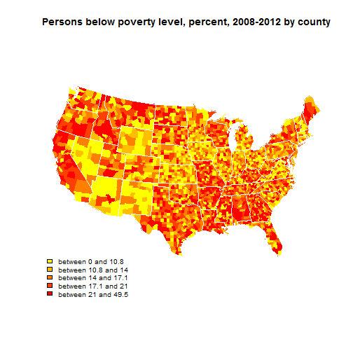

## Web Application to Map some of the 2013 Census Data by County

 * The web app is found at http://lyndafinn.shinyapps.io/Maps  

 * The census data is from 2013. I chose some of the most interesting variables  for plotting. It can be found here: http://quickfacts.census.gov/qfd/download_data.html

 * The application was based on the the shiny tutorial lesson 5, but I altered signicantly. The original tutorial can be seen here: http://shiny.rstudio.com/tutorial/lesson5/

--- .class #id 

## Modifications to Tutorial

In my code, I made the following modifications to the shiny tutorial:

* I used a wider set of census variables from a more up to date data source
* I modified the map coloring to be in the heatmap style
* I improved and corrected the labeling of the map categories. 
 * Each category now represents 20% of the data. This was necessary to plot such variables as population, because of its extreme skewness. Without the modification, the map was almost the lowest category (allyellow) 
  * In the original, the categories were improperly labeled with cutpoints, not ranges or midpoints
* I generalized the approach variables other than percentages could be plotted

--- .class #id 

## Functionality

The App plots the county data on the following:

|var1                |desc                                                                 |
|:-------------------|:--------------------------------------------------------------------|
|Population          |Population by County, 2013 estimate                                  |
|Change              |Population by County, percent change - April 1, 2010 to July 1, 2013 |
|Population per mile |Population per square mile by county, 2010                           |
|Under 5             |Persons under 5 years, percent by county                             |
|Under 18            |Persons under 18 years, percent by county                            |
|65 and Over         |Persons 65 years and over, percent by county                         |
|Percent White       |% White by county                                                    |
|Percent Black       |% Black by county                                                    |
|Percent Hispanic    |% Hispanic by county                                                 |
|Percent Asian       |% Asian by county                                                    |
|Median Income       |Median household income, 2008-2012 by county                         |
|Below Poverty       |Persons below poverty level, percent, 2008-2012 by county            |

--- .class #id 

## Example Output

Here is the map resulting from selecting "Below Poverty"

 
